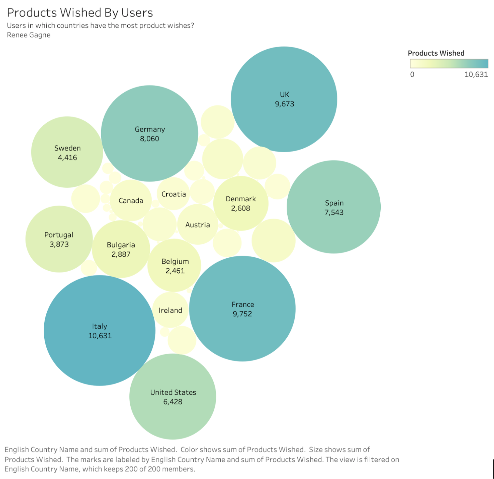

## Academic Portfolio

---
### Resume
[Resume](/pdf/Renee Gagne Analytics Resume.pdf)

---
### Interdisciplinary Ethics Tech Competition 2021 - 1st Place

##### I had the opportunity to collaborate with a team of graduate students to propose solutions to a real-world business problem. Our solution considered ethical, technological, legal, financial, and privacy-related domains to determine the optimal business solution. My primary contribution was that of researching the financial impacts of various business options. 
[Project Presentation Video](/https://vimeo.com/508527899/)

---

### French C2C E-Commerce - Team SQL Project
[Report: French C2C E-Commerce User Engagement Analytics Team Project in MySQL](/pdf/Team 20 Team Project.pdf)

##### I collaborated with a team to analyze and interpret French C2C E-Commerce data to better understand current trends and make suggestions to improve user engagement. My team and I began with a dataset and cleaned it, built a database, ran queries, created stored functions and procedures, researched present-day C2C trends, and composed a formal report.

---

### Rural To Urban Migration - Undergraduate Honors Thesis
[Rural to Urban Migration: An Investigation of the Connection Between Housing and Educational Attainment in Shanghai](/pdf/Renee_Gagne_Honors_Thesis.pdf)

##### I composed, edited, and defended an undergraduate honors thesis, Magna Cum Laude, while working closely with three CU faculty members. During the process, I conducted scholarly research on the relationship between institutional barriers, migrant housing, and educational attainment in Shanghai

--- 
### Portfolio Shortcuts

- [Resume](/pdf/Renee Gagne Analytics Resume.pdf)
- [Interdicplinary Ethics Tech Competition 2021](https://vimeo.com/508527899)
- [French C2C E-Commerce Team Project](/pdf/Team 20 Team Project.pdf)
- [Rural To Urban Migration:Thesis](/pdf/Renee_Gagne_Honors_Thesis.pdf)

---

---

Page template forked from <a href="https://github.com/evanca/quick-portfolio">evanca</a>

<!-- Remove above link if you don't want to attibute -->
